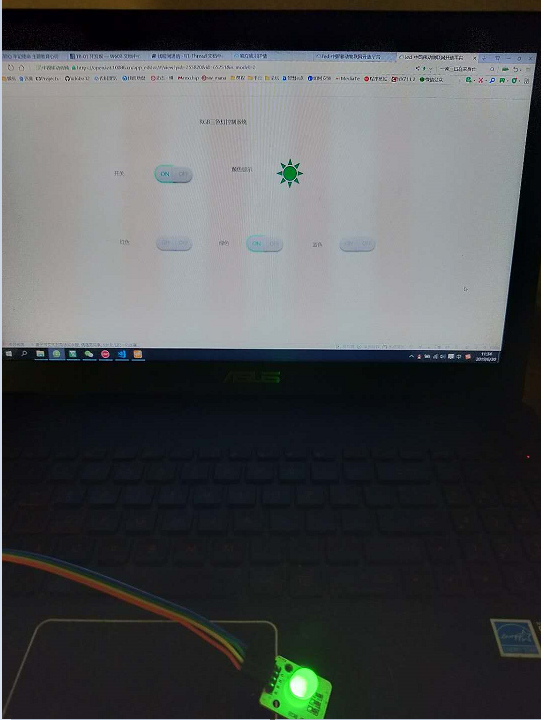

# RT_Thread W60X SDK使用教程

**一叶孤沙出品 : 一沙一世界，一叶一菩提**

## 简介

### 1.RT_Thread简介

[RT-Thread](https://www.rt-thread.org)是一个集实时操作系统（RTOS）内核、中间件组件和开发者社区于一体的技术平台，由熊谱翔先生带领并集合开源社区力量开发而成，RT-Thread也是一个组件完整丰富、高度可伸缩、简易开发、超低功耗、高安全性的物联网操作系统。RT-Thread具备一个IoT OS平台所需的所有关键组件，例如GUI、网络协议栈、安全传输、低功耗组件等等。经过11年的累积发展，RT-Thread已经拥有一个国内最大的嵌入式开源社区，同时被广泛应用于能源、车载、医疗、消费电子等多个行业，累积装机量超过2亿台，成为国人自主开发、国内最成熟稳定和装机量最大的开源RTOS。

### 2.W60X简介

W60X系列Wi-Fi SoC芯片是由国内联盛德公司研发，目前要有W600和W601两款芯片，本项目采用W600,W600是一款支持多接口、多协议的无线局域网 IEEE802.11n（1T1R）的 SoC 芯片。适用于智能家 电、智能家居、无线音视频、智能玩具、医疗监护、工业控制等物联网应用领域。

(1) 为什么选择W600?

一次偶然的会议上，我了解到了W600的存在，号称在华为Hilink项目上，有客户使用esp8266没有通过华为的认证，而使用W600通过了华为认证，原来我以为在wifi性价比的道路上除了乐鑫ESP8266和瑞昱RTL8710,恐难有敌手，于是开始对W600另眼相看，便开始某宝疯狂搜索，发现了一款9.9元基于W600的[TB_01开发板](https://item.taobao.com/item.htm?spm=a230r.1.14.19.266a48d12fW3q7&id=577016710862&ns=1&abbucket=8#detail)


TB-01 是星通智联开发的一款基于联盛德 W600 的超小体积核心开发板，该开发板引出了芯片的所有IO，并且内置LDO和UART传输芯片，只需一根 Micro USB 数据线与电脑连接即可使用，支持一键下载，外设拥有5个环形LED和2颗按键，调试操作极其方便。

### 3.RGB_LED项目简介

本文是关于RGB三色灯项目，基于RT_Thread提供的onenet-v1.0.0 packages连接中国移动onenet平台，packages中支持http和mqtt两种方式连接onenet,本项目采用mqtt方式连接，同时修改数据上报逻辑，原有组件包是每次回复单个数据点的数据，修改后支持一次性上报所有数据点，同时调整mqtt数据上报处理逻辑，解决连续两次调用数据发送接口，仅有第一次发出去的问题。

## 文档

如下是相关的文档教程, 方便大家使用.

* [TB_01官方资料](http://docs.thingsturn.com/product/)
* [Keil下RT_Thread W600 开发环境配置](http://docs.thingsturn.com/development/soc/start/)
* [W600固件烧录指南](http://docs.thingsturn.com/application_note/download_firmware/)

## 硬件资料

硬件资料包括M5Stack出品的ESP-CAM的硬件原理图, ESP32与OV2640的数据手册.

见文件夹 `.materials/硬件资料`

```
├── 数据手册
│   ├── WM_W600_APIs.chm
│   ├── WM_W600_ROM功能简述_V1.1.pdf
│   └── 
└── 原理图
    └── TB-01_V10.pdf
```

## 源代码使用说明

### 1.工程demos介绍

`examples/04_iot_onenet_rgb_led` 是本项目使用的源码入口

其他三个是星通智联提供的标准SDK，参考`RT-Thread_W60X_SDK/docs/UM3101-RT-Thread-W60X-SDK 开发手册`，[官方SDK下载地址](http://docs.thingsturn.com/development/rt-thread/start/)

### 2.开发移植

(1) 修改路由器密码

修改rt_config.h中106和107行，将路由器账号密码换成自己的

```
#define RT_WLAN_DEFAULT_SSID "LBAGMY"
#define RT_WLAN_DEFAULT_PASSWORD "libo#520&gaomingyue"
```

(2) 修改MQTT配置参数

修改rt_config.h中226、227和228行，将registeration code、product_id、master_apikey换成自己的

```
#define ONENET_REGISTRATION_CODE "90UwmiI5QxPma2ql"
#define ONENET_INFO_PROID "255820"
#define ONENET_MASTER_APIKEY "eCQJZEKoyVqA5qV4ef3qTH2OZzo="
```
(3) 云端创建产品

* 创建产品

操作系统这里使用RT_Thread，没有此选项，选用linux即可


* 创建数据点

数据流模板->添加数据流模板


创建产品数据点，此处创建power和color两个数据点，power表示总开关，power为0时候，灯关闭;power不为0的时候，color数值起作用，用以选择不同模式。

* 创建后台显示数据面板

应用管理->独立应用->添加应用


注意：红色、绿色、蓝色按钮和颜色显示图片均链接color数据点，颜色显示图片仅显示左右，按钮可以下发选择不同的灯颜色。

(4) 设备下载重启

```
 \ | /
- RT -     Thread Operating System
 / | \     4.0.0 build Jun 30 2019
 2006 - 2018 Copyright by rt-thread team
lwIP-2.0.2 initialized!
[32m[5] I/SAL_SOC: Socket Abstraction Layer initialize success.

[0m[32m[64] I/WLAN.dev: wlan init success

[0m[32m[95] I/WLAN.lwip: eth device init ok name:w0

[0m[32m[100] I/WLAN.dev: wlan init success

[0m[32m[132] I/WLAN.lwip: eth device init ok name:w1

[0m[D/FAL] (fal_flash_init:61) Flash device |                nor_flash | addr: 0x00000000 | len: 0x00100000 | blk_size: 0x00001000 |initialized finish.
[32;22m[I/FAL] ==================== FAL partition table ====================[0m
[32;22m[I/FAL] | name      | flash_dev |   offset   |    length  |[0m
[32;22m[I/FAL] -------------------------------------------------------------[0m
[32;22m[I/FAL] | app       | nor_flash | 0x00010000 | 0x00080000 |[0m
[32;22m[I/FAL] | download  | nor_flash | 0x00090000 | 0x00060000 |[0m
[32;22m[I/FAL] | fs_part   | nor_flash | 0x000f0000 | 0x0000b000 |[0m
[32;22m[I/FAL] | easyflash | nor_flash | 0x000fb000 | 0x00001000 |[0m
[32;22m[I/FAL] =============================================================[0m
[32;22m[I/FAL] RT-Thread Flash Abstraction Layer (V0.3.0) initialize success.[0m
[Flash] EasyFlash V3.3.0 is initialize success.
[Flash] You can get the latest version on https://github.com/armink/EasyFlash .
msh />[32m[4268] I/WLAN.mgnt: wifi connect success ssid:LBAGMY

[0m[D/ONENET] (onenet_mqtt_init:201) onnect mqtt init
[D/ONENET] (mqtt_connect_callback:85) Enter mqtt_connect_callback!
[36;22m[I/ONENET] RT-Thread OneNET package(V1.0.0) initialize success.[0m
[32m[5296] I/WLAN.lwip: Got IP address : 192.168.1.6

[0m[32m[5477] I/MQTT: MQTT server connect success

[0m[D/ONENET] (mqtt_online_callback:90) Enter mqtt_online_callback!
buffer : {"power":"10","color":"4"}
topic_name is:$dp[31m[30547] E/MQTT: [30547] wait Ping Response res: 0

[0m[D/ONENET] (mqtt_offline_callback:96) Enter mqtt_offline_callback!
[D/ONENET] (mqtt_connect_callback:85) Enter mqtt_connect_callback!
[32m[35662] I/MQTT: MQTT server connect success

[0m[D/ONENET] (mqtt_online_callback:90) Enter mqtt_online_callback!
buffer : {"power":"10","color":"4"}
topic_name is:$dp[D/ONENET] (mqtt_callback:60) topic $creq/a2a663b4-5b87-57ad-81d8-9e563659e540 receive a message
[D/ONENET] (mqtt_callback:62) message length is 1
recv data is 2
recv int data is:2

buffer : {"power":"10","color":"2"}
topic_name is:$crsp/a2a663b4-5b87-57ad-81d8-9e563659e540buffer : {"power":"10","color":"2"}
topic_name is:$dp[D/ONENET] (mqtt_callback:60) topic $creq/e08cd093-66ec-5e43-812c-ae7d2cd2cf5c receive a message
[D/ONENET] (mqtt_callback:62) message length is 1
recv data is 3
recv int data is:3

buffer : {"power":"10","color":"3"}
topic_name is:$crsp/e08cd093-66ec-5e43-812c-ae7d2cd2cf5cbuffer : {"power":"10","color":"3"}
topic_name is:$dp[D/ONENET] (mqtt_callback:60) topic $creq/65824a18-f17c-5286-b4b6-7f13a4d76246 receive a message
[D/ONENET] (mqtt_callback:62) message length is 1
recv data is 4
recv int data is:4

buffer : {"power":"10","color":"4"}
topic_name is:$crsp/65824a18-f17c-5286-b4b6-7f13a4d76246buffer : {"power":"10","color":"4"}
topic_name is:$dp

```

(5) 后台显示

红灯模式


绿灯模式



蓝灯模式


## 大漠孤沙


作者: 一叶孤沙 (QQ 2985672336)

QQ交流群：906015840 (备注：物联网项目交流)